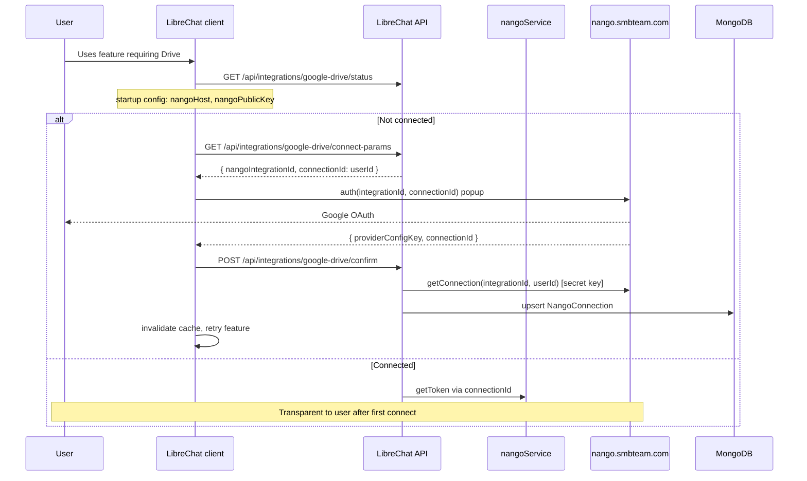

# Nango OAuth Integrations — Architecture & Implementation Plan

**Status:** In progress (core flow shipped on branch; prod hardening pending)  
**Feature branch (both repos):** `feat/nango-oauth-integrations`  
**Latest commits:** `AI-Workforce-Pro` `74ec7c687`, Admin Panel `42cb9b8`  
**Last updated:** 2026-06-19

This document is the single source of truth for integrating external services (Google Drive, Gmail, Microsoft, Dropbox, Box, Clio) via [Nango](https://nango.dev) in LibreChat and the Admin Panel.

---

## Table of contents

1. [Goals](#goals)
2. [Business decisions](#business-decisions)
3. [SDK versions & deployment constraint](#sdk-versions--deployment-constraint)
4. [Current Nango setup](#current-nango-setup)
5. [Architecture overview (legacy OAuth)](#architecture-overview-legacy-oauth)
6. [Smooth logins (UX)](#smooth-logins-ux)
7. [Data model](#data-model)
8. [Provider registry](#provider-registry)
9. [Environment variables](#environment-variables)
10. [API endpoints](#api-endpoints)
11. [Repository layout](#repository-layout)
12. [Implementation phases (PRs)](#implementation-phases-prs)
13. [Adding a new provider](#adding-a-new-provider)
14. [Security](#security)
15. [Testing](#testing)
16. [Pending work](#pending-work)
17. [Future: Connect UI migration](#future-connect-ui-migration)
18. [Out of scope](#out-of-scope)

---

## Goals

- Use **Nango** as the OAuth orchestrator for third-party integrations (credentials, refresh, popup OAuth).
- **Per-user connections:** each employee connects their own Google/Microsoft/etc. account.
- **Smooth logins:** Nango legacy `auth()` popup, lazy connect in LibreChat when a feature needs Drive/Gmail/Calendar — no custom OAuth forms in LibreChat.
- **Scalable provider list:** adding a provider = Nango dashboard config + registry entry + i18n (no duplicated auth logic).
- **Admin Panel:** audit and support (who is connected in a tenant), not a replacement for end-user connect flows.

---

## Business decisions

| Topic | Decision | Notes |
|-------|----------|-------|
| **Who can use integrations?** | **Whole platform** | All tenants and users see enabled providers in LibreChat / Admin Panel |
| **Who owns OAuth credentials?** | **Each user** | One Google account per employee |
| **Per-tenant OAuth apps?** | **No** | Tenants do not get separate Nango integrations or Client IDs |
| Connection ownership | **Per-user** | Mongo `NangoConnection` keyed by `{ userId, providerKey }` |
| Primary connect UX | **LibreChat client** | Modal when user needs Drive/Gmail/Calendar (lazy connect) |
| Admin Panel role | **Complement** | Tenant admins **audit** who in their org is connected |
| OAuth app credentials | **Platform-level in Nango** | One `google-drive` / `google-mail` / `google-calendar` row in Nango; many **connections** under each |
| Nango deployment | **Self-hosted** | `https://nango.smbteam.com` (v0.36.x) |
| Default auth UI | **Legacy `nango.auth()`** | Required for self-hosted v0.36 — Connect UI not available |

### Platform vs tenant vs user

| Layer | What it means | Example |
|-------|----------------|---------|
| **Platform** | Integration templates exist once in Nango + registry `enabled: true` | Everyone can connect Google Drive |
| **Tenant** | Optional **visibility** via admin grants (`read:integrations`); tenant admin sees **list** of connections in their org | Acme Corp admin sees which Acme users connected Drive |
| **User** | Each employee runs OAuth popup with **their** Google account | `connectionId` in Nango = LibreChat `userId` |

The **"1"** on each row in the Nango dashboard is **one connection** (one user authorized), not one tenant.

### Nango concepts (do not confuse)

| Nango term | Meaning |
|------------|---------|
| **Integration** | OAuth template (e.g. `google-drive`) — Client ID/Secret, scopes — configured once in dashboard |
| **Connection** | One user's authorized account — `connectionId` in legacy flow = LibreChat `userId` |

---

## SDK versions & deployment constraint

Self-hosted Nango at **`https://nango.smbteam.com` is v0.36.78**. It does **not** expose `POST /connect/sessions` (Connect UI). All repos pin SDKs to the **0.36.101** line and use **legacy OAuth**.

| Package | Version | Where |
|---------|---------|--------|
| `@nangohq/node` | `0.36.101` | `packages/api` (backend) |
| `@nangohq/frontend` | `0.36.101` | LibreChat `client` only |
| `@icons-pack/react-simple-icons` | `^13.13.0` | Admin Panel (provider brand icons) |

**Do not upgrade SDKs** to 0.43+ (Connect UI) or 0.67+ (`/connections` plural API) until the self-hosted Nango server is upgraded to match.

---

## Current Nango setup

| Integration ID (Nango) | Provider | Registry `enabled` | Notes |
|------------------------|----------|-------------------|--------|
| `google-drive` | Google Drive | Yes | Scopes: `drive.readonly`, `drive.file` |
| `google-mail` | Gmail | Yes | Match Nango dashboard ID exactly |
| `google-calendar` | Google Calendar | Yes | Match Nango dashboard ID exactly |

| Item | Value |
|------|--------|
| Nango server version | ~0.36.78 (self-hosted) |
| Callback URL | `https://nango.smbteam.com/oauth/callback` |
| API host | `NANGO_HOST=https://nango.smbteam.com` |
| Legacy OAuth path | `/oauth/connect/{integrationId}?connection_id={userId}` |

**Planned later** (configure in Nango, then enable in registry):

- Microsoft
- Dropbox
- Box
- Clio

---

## Architecture overview (legacy OAuth)

### High-level flow



Optional **PR-2:** Nango webhook `auth` event can also upsert Mongo (redundant with `confirm` but useful for prod resilience).

### Layer responsibilities

| Layer | Responsibility |
|-------|----------------|
| **Nango** | Credentials, token refresh, OAuth popup (`/oauth/connect/...`) |
| **Mongo `NangoConnection`** | Metadata mirror: `connectionId`, `userId`, `tenantId`, `providerKey`, `status` |
| **LibreChat API** | Connect params + confirm (secret key never in browser); token endpoint for agents |
| **Frontend** | `@nangohq/frontend@0.36.101` — `new Nango({ host, publicKey }).auth(integrationId, connectionId)` |

### Who does what

| Actor | Where | Action |
|-------|-------|--------|
| Employee | LibreChat client | Connect **their** account via attach menu (Drive/Gmail/Calendar) |
| Tenant admin | Admin Panel | **Read-only audit:** own status on `/integrations`; per-user popup in Users / Tenant admins |
| Platform admin | Admin Panel | Same audit capabilities; scoped by tenant when applicable |
| Dev/platform | Nango dashboard | OAuth apps, scopes, public/secret keys, webhooks (PR-2) |

---

## Smooth logins (UX)

| Requirement | Implementation |
|-------------|----------------|
| No custom OAuth forms in LibreChat | Nango popup via `auth()` |
| Short path per provider | One integration ID per provider (`google-drive`, etc.) |
| No unnecessary re-login | Nango refresh; store only `connectionId` locally |
| Reconnect | Same `auth()` flow; stale Mongo row removed on disconnect |
| Connect in context | CTA when agent/tool needs Drive — not only a settings page |
| Connection identity | `connectionId` = authenticated LibreChat `userId` |

**Anti-patterns (avoid):**

- Reimplementing MCP-style OAuth (PKCE, custom callbacks, `FlowStateManager`)
- Forcing users to Admin Panel only to connect Drive from chat
- Exposing `NANGO_SECRET_KEY` or long-lived access tokens to the browser
- Using Connect UI SDK methods (`openConnectUI`, `createConnectSession`) against v0.36 server

---

## Data model

### MongoDB: `NangoConnection`

```typescript
{
  userId: ObjectId,           // LibreChat user
  tenantId?: string,          // for tenant-scoped admin lists
  providerKey: string,        // e.g. 'google-drive' (our registry key)
  nangoIntegrationId: string, // e.g. 'google-drive' (Nango integration ID)
  connectionId: string,       // Nango connection_id (= userId string in legacy flow)
  status: 'connected' | 'expired' | 'revoked',
  connectedAt: Date,
  createdAt / updatedAt
}
```

**Indexes:**

- Unique: `{ userId, providerKey }`
- Query: `{ tenantId, providerKey }`

### Legacy connection identity

In the 0.36 popup flow, the frontend calls:

```typescript
await nango.auth(nangoIntegrationId, connectionId);
```

where `connectionId` is the LibreChat user ID returned by `GET .../connect-params`. The backend verifies the connection with `nango.getConnection(integrationId, userId)` before upserting Mongo.

---

## Provider registry

Location: `packages/api/src/integrations/providers.ts`

| Registry key | Nango integration ID | Enabled in code |
|--------------|----------------------|-----------------|
| `google-drive` | `google-drive` | `true` |
| `google-mail` | `google-mail` | `true` |
| `google-calendar` | `google-calendar` | `true` |
| `microsoft` | `microsoft` | `false` |
| `dropbox` | `dropbox` | `false` |
| `box` | `box` | `false` |
| `clio` | `clio` | `false` |

---

## Environment variables

### Backend (`.env` / `.env.example`)

```env
# Required for integrations (both must be set)
NANGO_SECRET_KEY=          # server-only — Environment settings > API Keys
NANGO_PUBLIC_KEY=          # browser-safe — same dashboard, Public Key (UUID)

# Self-hosted Nango API (defaults to https://api.nango.dev if unset)
NANGO_HOST=https://nango.smbteam.com

# PR-2: verify POST /api/webhooks/nango
NANGO_WEBHOOK_SECRET=
```

`isNangoConfigured()` returns true only when **both** `NANGO_SECRET_KEY` and `NANGO_PUBLIC_KEY` are set.

Startup config (`GET /api/config`) exposes to the client:

- `integrationsEnabled: boolean`
- `nangoHost: string`
- `nangoPublicKey: string`

### Admin Panel (`.env`)

```env
# Optional — only needed if Admin Panel env documents NANGO_HOST for operators
NANGO_HOST=https://nango.smbteam.com
```

Admin Panel server functions call the LibreChat Admin API only. The panel does **not** run OAuth in the browser (`@nangohq/frontend` was removed). Connect/disconnect happens in LibreChat.

### LibreChat client

No secrets in `.env`. Reads `nangoHost` and `nangoPublicKey` from startup config.

---

## API endpoints

### User-facing (LibreChat JWT)

Base path: `/api/integrations`

| Method | Path | Description |
|--------|------|-------------|
| `GET` | `/` | All providers + status for current user (syncs from Nango on read) |
| `GET` | `/:providerKey/status` | Single provider status |
| `GET` | `/:providerKey/connect-params` | `{ nangoIntegrationId, connectionId }` for `auth()` |
| `POST` | `/:providerKey/confirm` | Verify connection in Nango + upsert Mongo after OAuth |
| `DELETE` | `/:providerKey` | Disconnect (Nango + Mongo) |
| `GET` | `/:providerKey/token` | Fresh access token — **server/agents only**, not browser |

### Admin (requires `access:admin` + capabilities)

Base path: `/api/admin/integrations`

| Method | Path | Capability | Description |
|--------|------|------------|-------------|
| `GET` | `/` | `read:integrations` | Current admin user's provider statuses |
| `GET` | `/tenant` | `read:integrations` | All connections in caller's tenant (legacy listing API) |
| `GET` | `/users/:userId` | `read:integrations` | Provider statuses for a user (tenant-scoped) |
| `GET` | `/:providerKey/connect-params` | `manage:integrations` | Legacy — not used by Admin Panel UI |
| `POST` | `/:providerKey/confirm` | `manage:integrations` | Legacy — not used by Admin Panel UI |
| `DELETE` | `/:providerKey` | `manage:integrations` | Legacy — not used by Admin Panel UI |

### Webhooks (PR-2 — pending)

| Method | Path | Description |
|--------|------|-------------|
| `POST` | `/api/webhooks/nango` | Nango `auth` events → upsert `connectionId` (optional redundancy with `confirm`) |

### Capabilities

| Capability | Implies |
|------------|---------|
| `read:integrations` | — |
| `manage:integrations` | `read:integrations` |

Defined in `packages/data-schemas/src/admin/capabilities.ts`.

---

## Repository layout

### Backend (`AI-Workforce-Pro`)

```
packages/
├── api/src/integrations/
│   ├── index.ts
│   ├── providers.ts
│   ├── googleDrive/driveApi.ts
│   └── nango/
│       ├── client.ts          # getNangoClient(), getNangoPublicKey(), isNangoConfigured()
│       ├── service.ts         # connect params, confirm, sync, disconnect, status, token
│       ├── handlers.ts        # user + admin HTTP handlers
│       └── handlers.spec.ts
└── data-schemas/src/
    ├── schema/nangoConnection.ts
    ├── models/nangoConnection.ts
    ├── methods/nangoConnection.ts
    └── types/integration.ts

api/server/routes/
├── integrations.js
└── admin/integrations.js
```

### Admin Panel (`AI-Workforce-Pro-Admin-Panel`)

```
src/
├── constants/integrations.ts
├── types/integration.ts
├── server/integrations.ts          # read-only admin API wrappers
├── components/integrations/
│   ├── IntegrationsPage.tsx        # own-account status cards (read-only)
│   ├── ProviderCard.tsx
│   ├── ConnectionStatusBadge.tsx
│   ├── IntegrationProviderIcon.tsx # @icons-pack/react-simple-icons
│   ├── IntegrationProviderLabel.tsx
│   └── UserIntegrationsDialog.tsx  # Users + Tenant admins tables
└── routes/_app/integrations.tsx
```

**UX:** OAuth connect happens only in LibreChat. Admin Panel is audit/support UI.

### LibreChat client

```
client/src/
├── hooks/integrations/useNangoConnect.ts
├── data-provider/Integrations/
│   ├── queries.ts
│   └── mutations.ts           # connect-params + confirm
└── components/Integrations/
    ├── ConnectProviderPrompt.tsx
    └── attachMenu.ts
```

Dependency: `@nangohq/frontend@0.36.101`

---

## Implementation phases (PRs)

| PR | Repo | Scope | Status |
|----|------|-------|--------|
| **PR-1** | Backend | Registry, `nangoService`, Mongo schema, user + admin routes, capabilities, tests | **Done** |
| **PR-4** | LibreChat client | Lazy connect inline (Drive, Gmail, Calendar) | **Done** |
| **PR-3** | Admin Panel | Read-only Integrations page, user audit dialogs, nav, i18n EN/ES | **Done** |
| **PR-5** | Backend | Token endpoint + `google_drive` agent tool | **Done** |
| **Legacy migration** | Both | SDK 0.36.101, `auth()` flow, connect-params/confirm endpoints | **Done** |
| **PR-2** | Backend | Webhook handler, signature verification | **Pending** (before prod) |
| **PR-6** | Both | Enable Microsoft, Dropbox, Box, Clio in registry + Nango | **Pending** |
| **PR-7** | Both | Reconnect UX polish, connect links by email (optional) | **Pending** |

### Recommended order

```
PR-1 → PR-4 → PR-3 → PR-5 → Legacy OAuth → PR-2 (before prod)
                                    ↘ PR-6 → PR-7
```

**Local dev without PR-2:** after OAuth popup succeeds, the client calls `POST .../confirm`, which verifies via `getConnection` and upserts Mongo. `GET /integrations` also syncs enabled providers from Nango on read.

### PR-1 acceptance criteria (backend)

- [x] `GET /api/integrations/google-drive/connect-params` returns `{ nangoIntegrationId, connectionId }` when Nango is configured
- [x] `POST /api/integrations/google-drive/confirm` upserts Mongo after OAuth
- [x] Per-user Mongo record keyed by `{ userId, providerKey }`
- [x] `GET /integrations` syncs from Nango via `listConnections(userId)` (SDK 0.36)
- [x] Admin `GET /api/admin/integrations/tenant` for tenant admins
- [x] Admin `GET /api/admin/integrations/users/:userId` with tenant scoping
- [x] Unit tests for handlers

### PR-2 acceptance criteria (webhook)

- [ ] `POST /api/webhooks/nango` verifies HMAC with `NANGO_WEBHOOK_SECRET`
- [ ] On `auth` success: upsert `NangoConnection` using connection id + integration id
- [ ] On revoke/override: update or delete local metadata
- [ ] Register webhook URL in Nango dashboard → LibreChat public URL

### PR-3 acceptance criteria (Admin Panel)

- [x] Route `/integrations` in sidebar (requires `read:integrations` or `manage:integrations`)
- [x] Provider cards with status badge (Connected / Not connected / Disabled) — **read-only**
- [x] **No Connect button** in Admin Panel (OAuth only from LibreChat)
- [x] Users page + Tenant admins table: per-user integrations dialog
- [x] Provider brand icons via `@icons-pack/react-simple-icons`

### PR-4 acceptance criteria (LibreChat client)

- [x] When tool/agent needs Drive and user not connected → inline prompt
- [x] After OAuth + confirm → retry operation
- [x] No Admin Panel redirect required for normal users

### PR-5 acceptance criteria (token endpoint)

- [x] `GET /api/integrations/:providerKey/token` returns fresh OAuth access token for authenticated user
- [x] Not exposed in `librechat-data-provider` (server/agents only)

---

## Adding a new provider

1. Create/configure integration in **Nango dashboard** (OAuth app, scopes).
2. Add entry to `INTEGRATION_PROVIDERS` in `providers.ts` with `enabled: true`.
3. Add i18n keys + icon in Admin Panel and client locales.
4. (If needed) wire agent/tool to call `/api/integrations/:providerKey/token` or Nango proxy.

No changes to connect-params / confirm / disconnect handler logic beyond the registry entry.

---

## Security

- `NANGO_SECRET_KEY` and `NANGO_WEBHOOK_SECRET` **server-only**.
- `NANGO_PUBLIC_KEY` is **intentionally exposed** to the browser (required for legacy `auth()`).
- User routes: `requireJwtAuth` — users can only connect/disconnect **their own** connections (`connectionId` = their `userId`).
- Admin tenant list: requires `tenantId` on caller (tenant admin).
- Access tokens for agents: server-side only; never return in JSON to browser.

---

## Testing

### Backend unit tests

```bash
cd packages/api
npx jest src/integrations/nango/handlers.spec.ts --no-coverage
npx jest src/integrations/googleDrive/driveApi.spec.ts --no-coverage
```

Pre-commit (backend):

```bash
npx lint-staged --config ./.husky/lint-staged.config.js
npm run test:all
npm run build
```

### Admin Panel

```bash
npm run lint-staged
npm run typecheck
npm run test
npm run build
```

### Manual smoke (legacy flow)

1. Set `NANGO_SECRET_KEY`, `NANGO_PUBLIC_KEY`, and `NANGO_HOST` in LibreChat `.env`.
2. Restart backend and Admin Panel.
3. Log in as a test user → `GET /api/config` should show `integrationsEnabled: true`, `nangoHost`, `nangoPublicKey`.
4. LibreChat chat → attach menu (clip) → **From Google Drive** → Connect → Google OAuth popup.
5. After OAuth completes → `GET /api/integrations/google-drive/status` shows `connected`.
6. Admin Panel `/integrations` shows **Connected** for that admin's own account (read-only).
7. Admin Panel **Users** or **Tenant admins** → integrations icon → dialog lists that user's providers.
8. Verify connection in Nango dashboard (`connection_id` = LibreChat `userId`).

**Google Drive agent tool (optional E2E):** requires Agents endpoint enabled locally — see [Pending work](#pending-work).

---

## Pending work

### Code (planned PRs)

| ID | Repo | Scope | Priority |
|----|------|-------|----------|
| **PR-2** | Backend | `POST /api/webhooks/nango` — HMAC verify, upsert on `auth`, revoke/delete on disconnect | **Before prod** |
| **PR-6** | Both | Enable Microsoft, Dropbox, Box, Clio (Nango dashboard + registry + UI) | Medium |
| **PR-7** | Both | Reconnect UX polish (expired/revoked tokens, clearer prompts) | Low |

**PR-2 checklist:**

- [ ] `POST /api/webhooks/nango` verifies HMAC with `NANGO_WEBHOOK_SECRET`
- [ ] On `auth` success: upsert `NangoConnection`
- [ ] On revoke/override: update or delete local metadata
- [ ] Register webhook URL in Nango dashboard → LibreChat public URL

### Product / UX gaps

| Item | Status |
|------|--------|
| **Google Drive file picker** | **Done** — search/list dialog + server download attach |
| **Gmail / Calendar agent tools** | **Done** — `google_mail`, `google_calendar` tools + agent checkboxes |
| **Post-connect chat actions** | **Done** — Gmail/Calendar attach as `.txt` context files |
| **Attach menu when connected** | **Done** — opens picker dialogs for Drive, Gmail, Calendar |

Remaining polish (optional): Google Picker JS widget, inline send-mail / create-event actions.

### Ops / release

- [ ] Push `feat/nango-oauth-integrations` and open PRs (both repos)
- [ ] Set `NANGO_*` env vars in dev/staging/prod
- [ ] Register Nango webhook after PR-2
- [ ] E2E test: connect via LibreChat + agent Drive search

### Local dev: enable Agents (for Drive tool test)

Production `librechat.yaml` keeps Agents hidden. For local E2E of the `google_drive` tool:

```env
# LibreChat .env
ENDPOINTS=anthropic,agents
```

```yaml
# librechat.yaml (dev only)
interface:
  agents:
    use: true
    create: true
endpoints:
  agents:
    disableBuilder: false
```

Restart backend after changes. Create an agent with **Google Drive** enabled, connect Drive via the attach menu, then ask the agent to search/list files.

---

## Future: Connect UI migration

When self-hosted Nango is upgraded to **≥0.45** with Connect UI enabled:

1. Upgrade `@nangohq/node` and `@nangohq/frontend` together (target ~0.70).
2. Replace `connect-params` / `confirm` / `auth()` with `createConnectSession` + `openConnectUI`.
3. Re-enable `end_user` tags and optional webhook-only persistence.
4. Remove `NANGO_PUBLIC_KEY` from startup config if Connect UI session tokens replace public-key auth.

Until then, **stay on 0.36.101** and the legacy flow documented above.

---

## Out of scope (current initiative)

- Replacing existing MCP OAuth flows
- Nango Functions / data sync pipelines
- BYO OAuth app per tenant
- Google Drive Picker UI (reverted; agent tool uses API search only)
- Public documentation on librechat.ai

---

## Related repos & branches

| Repo | Branch | Role |
|------|--------|------|
| `AI-Workforce-Pro` | `feat/nango-oauth-integrations` | API, Nango service, Mongo, webhooks |
| `AI-Workforce-Pro-Admin-Panel` | `feat/nango-oauth-integrations` | Integrations UI, server fns |

Admin Panel summary: `AI-Workforce-Pro-Admin-Panel/docs/NANGO_INTEGRATIONS.md`

---

## References

- [Nango Auth guide](https://nango.dev/docs/guides/auth/auth-guide)
- [Nango Node SDK](https://nango.dev/docs/reference/backend/backend-sdk/node)
- [Nango Frontend SDK](https://nango.dev/docs/reference/frontend/frontend-sdk)
- Internal: `docs/CONFIG_HIERARCHY.md` (Admin Panel config — separate concern)
